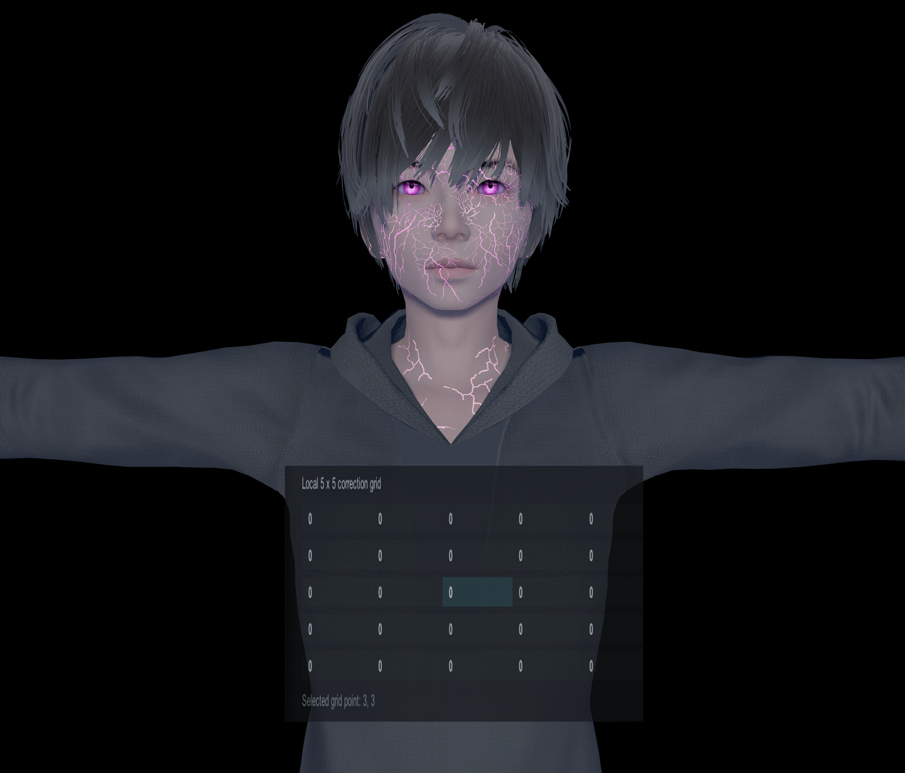
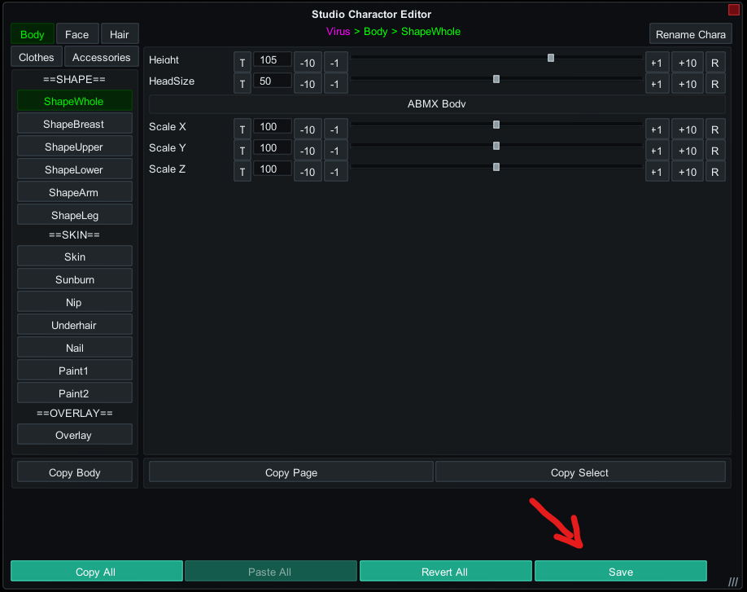
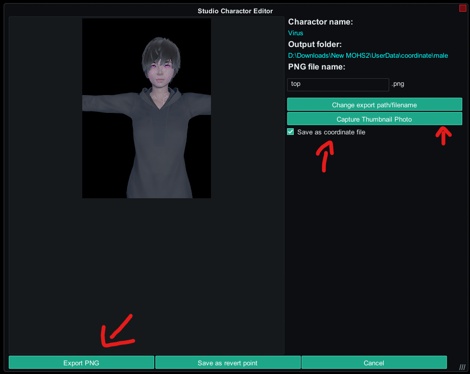

# Clothing Lab

  <iframe
    src="https://www.youtube-nocookie.com/embed/1FjhNVwViok"
    title="Clothing Lab video"
    allowfullscreen>
  </iframe>

**Clothing Lab** opens female clothing options for male characters.

Use it when you want to dress a male character with female tops, bottoms, bras, underwear, pantyhose, gloves, socks, or shoes.

The plugin adds female clothing entries to male characters, then adjusts the clothing to the male body shape. If the result is not clean, you can use the tools inside Clothing Lab to fix problem areas by hand.

At first, the main opened male clothing slots are **Top**, **Bottom**, **Gloves**, and **Shoes**. Clothing Lab also adds support for additional female clothing categories such as underwear, pantyhose, and socks.

## Requirement

Clothing Lab requires [**Studio Character Editor 2.6.0**](https://github.com/Hanmen-lab/StudioCharaEditor/releases/tag/v2.6.0) **+**.

## Quick Start

1. Open **Character Editor**.
2. Select the male character.
3. Choose the female clothing item you want to use.
4. Check how the clothing looks on the character.
5. If the item is **not a top**, it often needs little or no extra work.
6. If the item is a **top**, open **Pandarinka Toolkit**.
7. Go to **Clothing Lab**.
8. Open **Clothing Surface Fit**.
9. Start with the **Top** tab.
10. Adjust **Male outer fit** and **Chest arc smoothing**.
11. If a small area still looks wrong, open **Top Surface Mask Editor**.
12. Use **Apply to one connected component**, then click the clothing piece in the viewport.
13. Choose a mode such as **Depth**, **Surface Normal**, **Hide Islands**, or **Freeze**.
14. Use **Top Grid Warp** when you need more precise local control.

For bottoms, gloves, socks, shoes, pantyhose, and underwear items, the automatic fit is much easier. Tops need more attention because of the breast geometry in female clothing.

## Clothing Slots

Clothing Lab opens female clothing support for male characters.

The first main slots are:

- **Top**
- **Bottom**
- **Gloves**
- **Shoes**

Additional supported categories include:

- **Bra**
- **Underwear**
- **Pantyhose**
- **Socks**

Pick the clothing like you normally would. Clothing Lab handles the cross-gender fit in the background.

## Tops

Tops are the main area where Clothing Lab needs manual control because female tops were made around breast geometry.

Start with these settings:

- **Male outer fit**: controls the overall shape of the top around the male body.
- **Outer side relaxation**: smooths harsh changes around the sides of the chest and underarms.
- **Chest arc smoothing**: flattens the chest area and removes more of the original female chest shape.
- **Rebuild Surface Fit from current body**: rebuilds the fitted mesh if the sliders stop reacting or the body shape changed.

Try to get the top close with **Male outer fit** first. Then use **Chest arc smoothing** if the old female chest shape is still visible.

## Top Surface Mask Editor

Use **Top Surface Mask Editor** when only one part of the top needs correction.

The basic workflow:

1. Open **Top Surface Mask Editor**.
2. Choose the correction mode.
3. Click **Apply to one connected component**.
4. Click the clothing piece in the viewport.
5. Adjust the mode settings.

The clicked clothing island will be highlighted and edited separately from the rest of the top.

The editor has **15 pages** for each mode. Use different pages when you want to fix different areas separately.

Undo and redo work well here, so do not be afraid to test changes. Use **Ctrl + Z** to undo and **Ctrl + Shift + Z** to redo.

## Mask Modes

**Depth**

Moves the selected area forward or backward. Use it when a piece of fabric is slightly inside the body or floating too far away.

**Surface Normal**

Expands or contracts the selected area from all sides. This is useful for sleeves, curved fabric, and areas that need to become tighter or looser without moving in one flat direction.

**Hide Islands**

Hides unwanted connected pieces of clothing. Use it for extra small parts, broken pieces, or details that cannot be fixed cleanly.

**Freeze**

Blends painted vertices back toward their original clothing position. Use it when automatic fitting changed an area too much and you want that area closer to the original shape.

**Chest Arc**

Pushes the selected area toward the male chest arc. Use it when part of the top still keeps the old female chest curve.

**Outer**

Uses the broader outer body fit on the selected area. Use it when the selected area should follow the general body shape more closely.

## Grid Warp

**Top Grid Warp** gives more precise control over the fitted top.

The grid points are like zones of the top. Each number affects the part of the top under that grid area.

  

It uses a local **5 x 5** grid. Select a grid point, then adjust:

- **Point depth**: moves that part forward or backward.
- **Point horizontal**: moves that part left or right.
- **Point vertical**: moves that part up or down.

Use **Grid width**, **Grid height**, and **Grid edge softness** to control how large and soft the grid correction area is.

Use **Mirror grid edits left / right** when you want changes on one side to copy to the other side.

Grid Warp is best for small shape corrections after the main fit already looks close.

## Other Clothing Categories

Bottoms, bras, underwear, pantyhose, gloves, socks, and shoes are easier than tops.

In most cases:

1. Select the clothing item.
2. Check the fit on the character.
3. Use the matching Surface Fit section only if something looks wrong.

These categories do not need the same amount of manual editing as tops.

## Saving

Clothing Lab settings are saved with:

- character cards;
- clothing coordinates;
- Studio scenes.

This means you can save the outfit normally and load it later with its Clothing Lab adjustments.

To save the outfit as coordinates:

1. Open **Character Editor**.
2. Go to the **Save** tab.
3. Click **Capture Thumbnail Photo**.
4. Click **Save As Coordinate File**.
5. Click **Export PNG**.

  

  

## Common Problems

**Some clothes cannot be fully fixed**

Not every clothing mod can be corrected perfectly, especially tops. Some mods use unusual geometry, separated parts, or shapes that leave artifacts even after fitting and mask editing.

If a top still looks broken after using **Male outer fit**, **Chest arc smoothing**, **Top Surface Mask Editor**, and **Grid Warp**, try another clothing item or use a simpler top.

**Tops keep a visible breast shape on male characters**

On male characters with raised or heavily changed breast settings, some tops can still fit with a protruding chest shape. This will be fixed later, but for now the most stable setup for tops is the default breast settings.

**Clothing does not react to sliders or settings**

Click **Rebuild Surface Fit from current body**.

If it still does not react, open **Top Surface Mask Editor**, choose any mode, and click any clothing zone in the viewport. This can activate the clothing for editing.

## Notes

- Clothing Lab has full synergy with **Soft Body**. Use Clothing Lab first to fit female clothing to the male character, then use Soft Body for final manual mesh shaping if needed.
