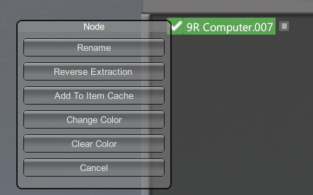
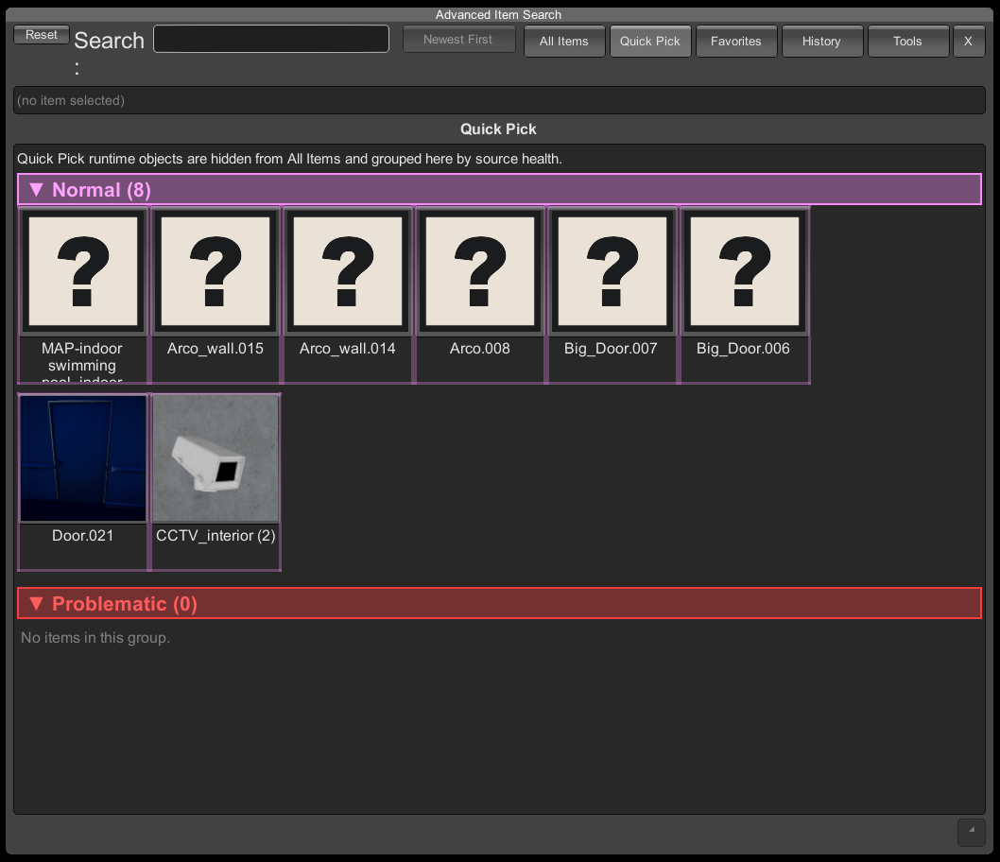
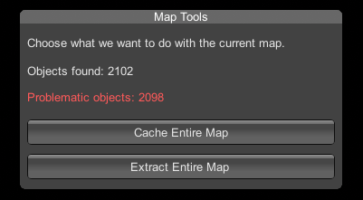
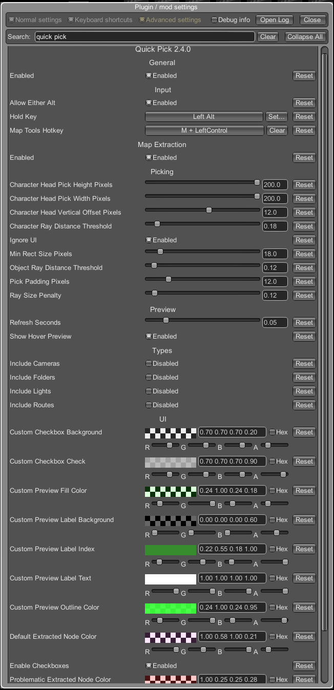

# Quick Pick

<div class="video-preview">
  <iframe
    src="https://www.youtube-nocookie.com/embed/8fqsfr5DKgk"
    title="Quick Pick video"
    allow="accelerometer; autoplay; clipboard-write; encrypted-media; gyroscope; picture-in-picture; web-share"
    allowfullscreen>
  </iframe>
</div>

[**Quick Pick**](https://www.patreon.com/collection/2136425?view=expanded) lets you select Studio objects directly in the viewport instead of searching for them in the workspace tree.

Use it in crowded scenes, large hierarchies, character setups, prop-heavy rooms, and maps where the object you need is visible on screen but hard to find in the tree.

Quick Pick is also a map asset tool. It can extract raw map assets into the Studio tree, cache them, move cached assets between maps, and make cached assets available inside [Advanced Item Search](https://gofile.io/d/m03H5K). This is one of the main reasons to use Quick Pick, not just an extra selection feature.

## Quick Start

1. Hold **Alt**.
2. Move the cursor over the object, character, or map object.
3. Use the mouse wheel if several candidates are under the cursor.
4. Left click to select the highlighted candidate.
5. Hold **Ctrl** while clicking to add it to the current selection.
6. Release **Alt** to return to normal camera control.

Quick Pick selects the object in the Studio tree, opens parent folders if needed, and scrolls the tree to the selected node.

## Viewport Picking

When the pick key is held, Quick Pick blocks camera movement so the viewport does not move while you are trying to select something.

The hover preview shows the object area and name. If several objects overlap, the preview shows an index like `1/3`. Scroll the mouse wheel to cycle through the candidates before clicking.

For characters, aim near the head when several characters are close together, overlapping, or playing animations.

For very small objects, objects behind other objects, or objects inside other objects, move the camera closer, change the angle, or use the mouse wheel to choose the exact candidate.

## Mesh Picking Mode

<div class="video-preview">
  <iframe
    src="https://www.youtube-nocookie.com/embed/LOCguoSpYMc"
    title="Quick Pick mesh picking mode video"
    allow="accelerometer; autoplay; clipboard-write; encrypted-media; gyroscope; picture-in-picture; web-share"
    allowfullscreen>
  </iframe>
</div>

**Mesh Picking Mode** is an optional precise picking mode for **Alt** picking. It lets Quick Pick detect objects by their actual mesh shape instead of only using the older broad bounds-based hover.

Mouse wheel cycling between overlapping hover candidates still works in this mode.

In Mesh Picking Mode, the hover label is shown at the bottom-center of the screen. It can be disabled in the plugin settings.

The precise mesh overlay has its own separate color setting in the plugin settings.

Notes:

- Characters still use the previous picking mode for now.
- Warning: precise mesh picking can noticeably lag on non-extracted live maps. Extracted maps do not suffer from this because they are handled like normal Studio objects.

## Tree Controls

Quick Pick can add small checkboxes to the Studio tree.

Unchecked nodes are ignored by viewport picking. This is useful when a large object, folder, or background prop keeps getting selected instead of the thing behind it.

If a parent folder is unchecked, its children are ignored too. A child can still be turned back on manually if you need that specific object to remain pickable.

Checkbox states are saved with the scene and restored after loading.

Right click a tree node to open the Quick Pick node menu. Depending on the selected object, it can include:

- **Rename**
- **Reverse Extraction**
- **Add To Item Cache**
- **Change Color**
- **Clear Color**

<p class="guide-image">
  
</p>

## Map Objects

Quick Pick can work with raw map objects, not only normal Studio items.

If you Alt-click a map object, Quick Pick can extract it into the Studio tree. Extracted map objects behave much closer to normal Studio items: they can be selected, copied, deleted, parented, colored in the tree, and edited with Material Editor when supported.

Extracted map objects are saved with the scene. Quick Pick restores them after loading and keeps their source map data so they can be rebuilt later.

**Add To Item Cache** saves an extracted map object into Quick Pick's item cache. After that, it can be used again through the cached item workflow instead of extracting the same source every time.

The cache file is stored here:

```text
BepInEx\Config\Pandarinka.QuickPick.ItemCache.txt
```

**Reverse Extraction** is available when Quick Pick can safely return the extracted item back to its original live map object. It removes the extracted Studio item and enables the original source object again.

Some map objects are marked as problematic. This usually means the source object is built in a way that is hard to move or cache reliably, such as static batching, combined meshes, or other optimized map structures.

## Advanced Item Search

<p class="guide-image">
  
</p>

[Advanced Item Search](https://gofile.io/d/m03H5K) is the search UI Quick Pick uses for cached map assets.

When you use **Add To Item Cache** on an extracted map object, Quick Pick saves that object source into its cache and registers it as a searchable item. After that, the cached asset can appear in Advanced Item Search and can be spawned again without manually finding the original object on the map.

Typical workflow:

1. Alt-click a map object to extract it.
2. Right click the extracted node in the Studio tree.
3. Click **Add To Item Cache**.
4. Open **Advanced Item Search**.
5. Search for the cached object and spawn it like a normal Studio item.

Use **Cache Entire Map** when you want Quick Pick to register all extractable assets from the current map. This is useful when you want to build your own reusable library from map props, decorations, architecture pieces, lights, furniture, or small environment objects.

Cached assets keep source map information. This allows Quick Pick to restore or rebuild them later, including when you move them to another map. If the cached asset comes from a different map, Quick Pick uses its saved source data to find the original asset again.

Red/problematic assets should not be treated as fully reliable cache items. They are marked because the source object is built in a problematic way and may not behave like a clean Studio item.

## Map Tools

<p class="guide-image">
  
</p>

Open **Map Tools** with **Ctrl+M** or the Quick Pick toolbar icon.

**Cache Entire Map** scans the current map and registers extractable map objects in the Quick Pick item cache.

**Extract Entire Map** creates a Studio folder named after the current map and extracts the map objects into that folder.

The window shows how many map objects were found and how many of them are problematic. Large maps can take time to process, so wait until the operation finishes before saving, loading, or changing maps.

For full map workflows, cache the map first, then extract it. This gives Quick Pick more source data to restore objects correctly after scene load or when moving cached objects between maps.

## Settings

<p class="guide-image">
  
</p>

The main config options are:

```text
Enabled: On
Hold Key: LeftAlt
Map Tools Hotkey: Ctrl+M
Allow Either Alt: On
Ignore UI: On
Show Hover Preview: On
Enable Checkboxes: On
```

All Quick Pick UI colors can be changed in the plugin settings, including hover preview colors, label colors, checkbox colors, and extracted/problematic node colors.

Object type options are off by default for special Studio objects:

```text
Include Lights: Off
Include Cameras: Off
Include Folders: Off
Include Routes: Off
```

Turn them on only if you want Quick Pick to select those object types from the viewport.

Picking sensitivity can also be adjusted in the config:

```text
Pick Padding Pixels
Min Rect Size Pixels
Object Ray Distance Threshold
Character Ray Distance Threshold
Ray Size Penalty
Character Head Pick Width Pixels
Character Head Pick Height Pixels
Character Head Vertical Offset Pixels
```

Increase padding or minimum rectangle size when tiny objects are hard to grab. Lower them if large nearby objects are winning too often.

## Common Problems

**Nothing highlights.**

Make sure **Enabled** is on, hold the configured pick key, and keep the cursor away from UI panels. If you are trying to select lights, cameras, folders, or routes, enable that object type in the config.

**The wrong object is selected.**

Use the mouse wheel while holding **Alt** to cycle through overlapping candidates. Changing the camera angle also helps when objects sit inside each other.

**A folder or large object blocks everything behind it.**

Disable that node with the tree checkbox, then try picking again. Turn the node back on later if you need it.

**A map object extracts, but cannot be moved normally.**

That source object is a problematic map object. Quick Pick marks these objects in red. Some maps use static batching, combined meshes, or special engine structures that cannot behave like clean Studio items.

**Cached or extracted map objects load as missing red objects.**

Update [Quick Pick](https://www.patreon.com/collection/2136425?view=expanded), make sure the source map is available, and load the scene with Scene Browser when possible. [Scene Browser separate import](https://www.patreon.com/posts/152468460?collection=2042055) is supported by the newer Quick Pick and Scene Browser versions.

**A cached asset does not show in Advanced Item Search.**

Install or update [Advanced Item Search](https://gofile.io/d/m03H5K), then reopen its window or refresh the list. Make sure the object was actually added with **Add To Item Cache** or **Cache Entire Map**. Red/problematic objects are not reliable cache assets.

**The scene may not load, or Studio may freeze on load.**

The default Studio scene loader can break with Quick Pick cached or extracted map objects. In bad cases the scene may not load at all, or Studio can lag/freeze hard during loading. The stable loader for this workflow is [Scene Browser Pro](https://www.patreon.com/posts/152468460?collection=2042055). This will not be fixed in Quick Pick because the problem is in the default Studio loading path.

## Notes

- Current [Quick Pick](https://www.patreon.com/collection/2136425?view=expanded) version in this guide: `3.0.0`.
- Quick Pick is made for **StudioNEOV2**.
- [BepInEx 5](https://github.com/BepInEx/BepInEx/releases) and [HS2API](https://gofile.io/d/VYsLtI) are required by the plugin.
- [Advanced Item Search](https://gofile.io/d/m03H5K) is used for cached map asset workflows.
- [Scene Browser separate import](https://www.patreon.com/posts/152468460?collection=2042055) is supported with compatible [Quick Pick](https://www.patreon.com/collection/2136425?view=expanded) and Scene Browser versions.
- Default Studio loading is not stable for scenes that contain cached or extracted map objects. Use [Scene Browser Pro](https://www.patreon.com/posts/152468460?collection=2042055).
- Quick Pick has compatibility issues with **Map Controller**. Use them together at your own risk. This will not be fixed. Using both can break or hide the map; if that happens, spawn another map first, then respawn the original map.
