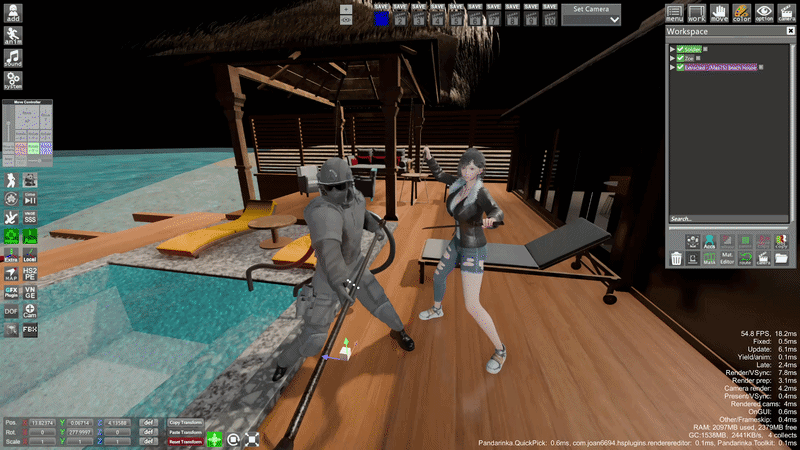
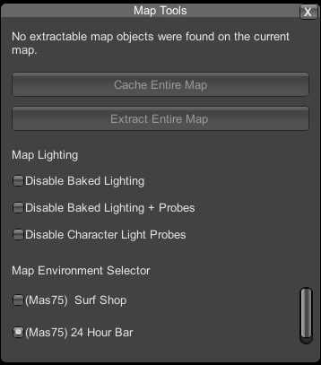
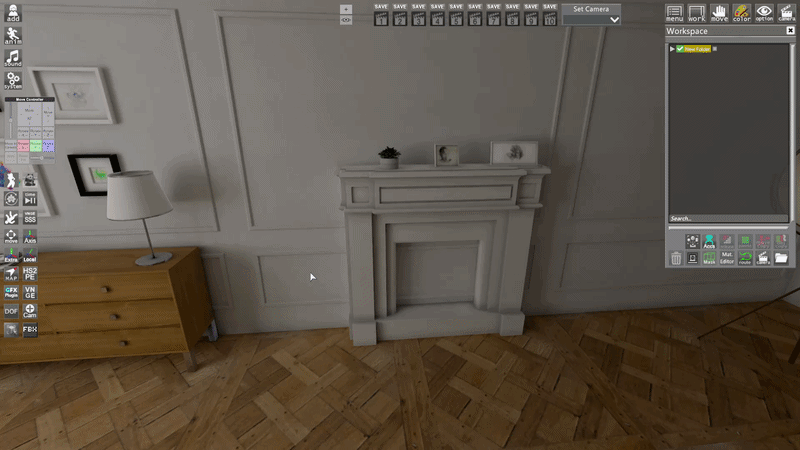
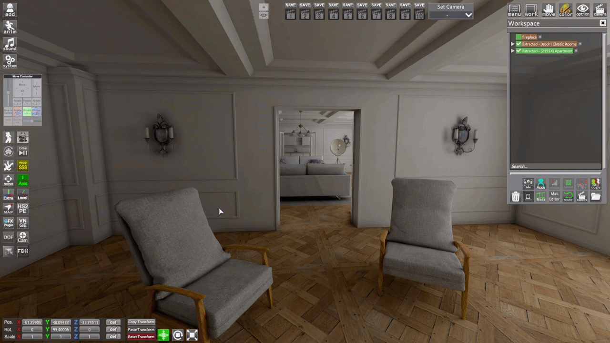
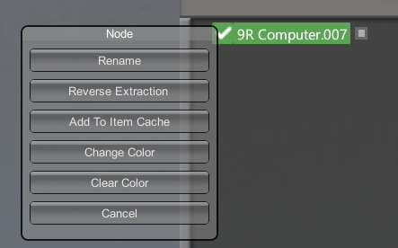
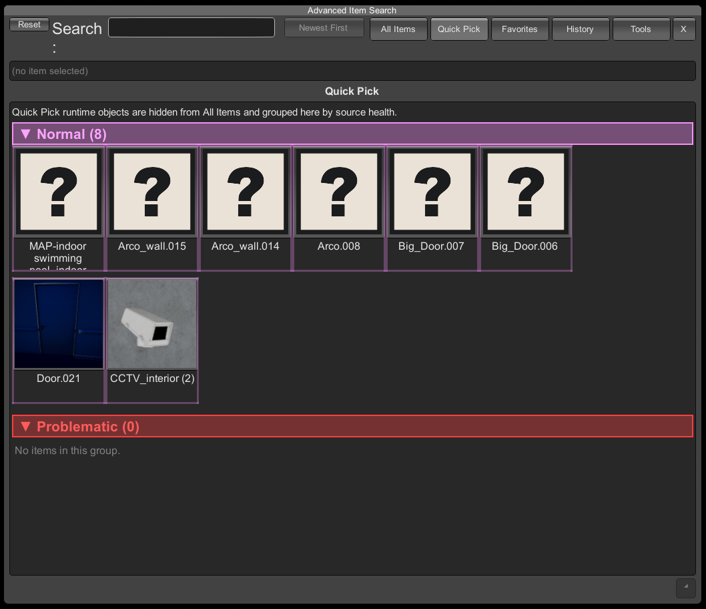
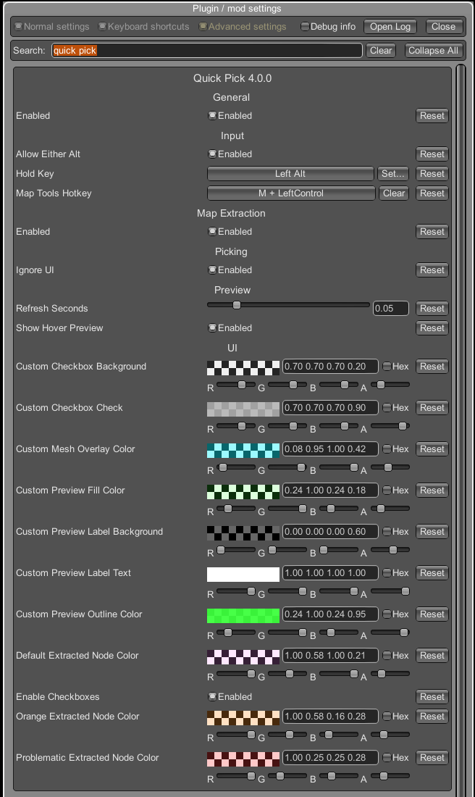

# Quick Pick

<div class="video-preview">
  <iframe
    src="https://www.youtube-nocookie.com/embed/4sLrykbvmME"
    title="Quick Pick video"
    allow="accelerometer; autoplay; clipboard-write; encrypted-media; gyroscope; picture-in-picture; web-share"
    allowfullscreen>
  </iframe>
</div>

[**Quick Pick**](quick-pick.md) lets you select Studio objects and characters directly in the viewport instead of searching for them in the workspace tree.

Use it in crowded scenes, large hierarchies, character setups, prop-heavy rooms, and maps where the object you need is visible on screen but hard to find in the tree.

Quick Pick is also a map asset tool. It can extract raw map assets into the Studio tree, cache them, move cached assets between maps, and make cached assets available inside [Advanced Item Search](https://gofile.io/d/m03H5K). This is one of the main reasons to use Quick Pick, not just an extra selection feature.

## Quick Start

1. Hold **Alt**.
2. Move the cursor over the object, character, or map object.
3. Use the mouse wheel if several candidates are under the cursor.
4. Left click to select the highlighted candidate.
5. Hold **Ctrl** while clicking to add it to the current selection.
6. Release **Alt** to return to normal camera control.

Quick Pick selects the object or character in the Studio tree, opens parent folders if needed, and scrolls the tree to the selected node.

## Viewport Picking

When the pick key is held, Quick Pick blocks camera movement so the viewport does not move while you are trying to select something.

The hover preview shows the object area and name. If several objects overlap, the preview shows an index like `1/3`. Scroll the mouse wheel to cycle through the candidates before clicking.

Object colors help you understand what Quick Pick found:

- <span class="quick-pick-purple">Purple objects</span> are standard map objects successfully extracted as independent Studio items.
- <span class="quick-pick-orange">Orange objects</span> are map pieces that were originally merged into a larger static mesh for performance. Quick Pick separates them from that combined structure and makes them movable again.

Orange indicates a recovered combined object, not a broken one.

Since **Quick Pick 4.0.0**, map objects on all maps can be moved separately after extraction in almost all cases. The main exception is objects that share one renderer, because they are still one rendered piece internally.

Objects that used to be shown as red/problematic are now handled as orange recovered combined objects. This is a major advantage over similar tools like **Map Controller**, because Quick Pick can separate and move many map pieces that are normally locked inside combined map meshes.

## Mesh Picking Mode

<p class="guide-image">
  
</p>

**Mesh Picking Mode** is the standard precise picking mode for **Alt** picking. It lets Quick Pick detect objects and characters by their actual mesh shape.

Mouse wheel cycling between overlapping hover candidates still works in this mode.

The precise mesh overlay has its own separate color setting in the plugin settings.

## Multiple Maps In One Scene

You can use Quick Pick to place two or more maps into one Studio scene.

Basic workflow:

1. Load the first map.
2. Open **Map Tools**.
3. Click **Extract Entire Map**.
4. Spawn or load the next map.
5. Open **Map Tools** again.
6. Extract the next map too, or leave it as the active live map if you only need one extracted map.
7. Repeat this with as many maps as you want.

After you extract a map, it becomes a normal Studio folder in the tree and stays in the scene. When you spawn another map after that, the new map becomes available for Quick Pick extraction right away.

You do not have to use **Cache Entire Map** for this workflow. Caching is for saving map assets into the Quick Pick item cache so you can find and spawn them later. For simply combining several maps in one scene, extraction is enough.

I still recommend extracting each map you want to keep. Extracted maps are saved with the scene, so you can build scenes with two maps, ten maps, or even more if your PC can handle it.

If you plan to use several maps in one scene, it is usually better to remove all checkboxes in **Map Environment Selector**. This lets you set up your own lighting and graphics without the maps fighting each other through their saved environment settings.

## Map Tools

<p class="guide-image">
  
</p>

Open **Map Tools** with **Ctrl+M** or the Quick Pick toolbar icon.

**Cache Entire Map** scans the current map and registers extractable map objects in the Quick Pick item cache.

**Extract Entire Map** creates a Studio folder named after the current map and extracts the map objects into that folder.

The window shows how many map objects were found and how many of them are orange combined objects. Large maps can take time to process, so wait until the operation finishes before saving, loading, or changing maps.

Use **Extract Entire Map** when you want to keep the current map inside the scene before spawning another map. Use **Cache Entire Map** only when you want to save the current map assets into the Quick Pick item cache for later.

### Map Lighting

<div class="guide-callout">

<p><strong>Disable Baked Lighting</strong> removes baked and realtime lightmap data from the current map and extracted map objects.</p>

<p><strong>Disable Baked Lighting + Probes</strong> also disables light and reflection probes for more complete lighting control.</p>

<p class="guide-image">
  
</p>

</div>

### Map Environment Selector

<div class="guide-callout">

<p class="guide-image">
  
</p>

<p><strong>Map Environment Selector</strong> preserves the original lighting and environmental look of extracted maps.</p>

<p>When a map is extracted, Quick Pick captures its environment before the original map is unloaded and creates a profile named after that map.</p>

<h4>What Is Captured</h4>

<p>Each profile stores:</p>

<ul>
  <li>Skybox material, shader, textures, colors, and other material parameters</li>
  <li>Fog mode, color, density, and distance</li>
  <li>Ambient lighting mode, intensity, and colors</li>
  <li>Reflection mode, resolution, intensity, and reflection bounces</li>
  <li>Custom reflections or the map's generated skybox reflection</li>
  <li>Lightmaps and light-probe data</li>
  <li>Subtractive shadow, halo, and flare settings</li>
  <li>Original states of the map's lights, projectors, and reflection probes</li>
  <li>Renderer lightmap indices and probe usage</li>
</ul>

<h4>How It Works</h4>

<p>Unity uses global environment settings, so several extracted maps cannot use different skyboxes, lightmaps, and ambient settings at the same time. Because of this, only one map environment profile can be active at once.</p>

<ul>
  <li>The first extracted map is selected automatically.</li>
  <li>Extracting another map adds a new environment entry without replacing the currently selected environment.</li>
  <li>Selecting another map applies its environment and activates its original lights, projectors, reflection probes, lightmaps, and probe assignments.</li>
  <li>Lighting and probe influence from other extracted maps is disabled to prevent environments from interfering with each other.</li>
  <li>Clicking the active entry again disables the map profile and restores the regular scene environment.</li>
  <li>Switching environments does not hide or remove map geometry.</li>
</ul>

<h4>Scene Persistence</h4>

<p>Captured profiles and the active selection are saved in the scene through <strong>Extended Save</strong>. When the scene loads again, Quick Pick restores the profiles, finds the needed skybox and reflection assets, and reapplies the selected environment after the map and other plugins finish loading.</p>

<p>This restore runs in several delayed passes because Unity and some graphics plugins can overwrite environment settings while the scene is loading. After restoration is complete, the selected map should keep the same skybox, lighting, reflections, and probe behavior it had before extraction.</p>

</div>

## Tree Controls

Quick Pick can add small checkboxes to the Studio tree.

Unchecked nodes are ignored by viewport picking. This is useful when a large object, folder, or background prop keeps getting selected instead of the thing behind it.

If a parent folder is unchecked, its children are ignored too. A child can still be turned back on manually if you need that specific object to remain pickable.

Checkbox states are saved with the scene and restored after loading.

Right click a tree node to open the Quick Pick node menu. Depending on the selected object, it can include:

- **Rename**
- **Reverse Extraction**
- **Add To Item Cache**
- **Change Color**
- **Clear Color**

<p class="guide-image">
  
</p>

## Map Objects

Quick Pick can work with raw map objects, not only normal Studio items.

If you Alt-click a map object, Quick Pick can extract it into the Studio tree. Extracted map objects behave much closer to normal Studio items: they can be selected, copied, deleted, parented, colored in the tree, and edited with Material Editor.

Extracted map objects are saved with the scene. Quick Pick restores them after loading and keeps their source map data so they can be rebuilt later.

**Add To Item Cache** saves an extracted map object into Quick Pick's item cache. After that, it can be used again through the cached item workflow instead of extracting the same source every time.

The cache file is stored here:

```text
BepInEx\Config\Pandarinka.QuickPick.ItemCache.txt
```

**Reverse Extraction** is available when Quick Pick can safely return the extracted item back to its original live map object. It removes the extracted Studio item and enables the original source object again.

## Advanced Item Search

<p class="guide-image">
  
</p>

[Advanced Item Search](https://gofile.io/d/m03H5K) is the search UI Quick Pick uses for cached map assets.

When you use **Add To Item Cache** on an extracted map object, Quick Pick saves that object source into its cache and registers it as a searchable item. After that, the cached asset can appear in Advanced Item Search and can be spawned again without manually finding the original object on the map.

Typical workflow:

1. Alt-click a map object to extract it.
2. Right click the extracted node in the Studio tree.
3. Click **Add To Item Cache**.
4. Open **Advanced Item Search**.
5. Search for the cached object and spawn it like a normal Studio item.

Use **Cache Entire Map** when you want Quick Pick to register all extractable assets from the current map. This is useful when you want to build your own reusable library from map props, decorations, architecture pieces, lights, furniture, or small environment objects.

If you want to use cached objects from several different maps, cache those maps first. Cache lets Quick Pick use those assets again later, even when another map is currently loaded.

Cached assets keep source map information. This allows Quick Pick to restore or rebuild them later, including when you move them to another map. If the cached asset comes from a different map, Quick Pick uses its saved source data to find the original asset again.

## Settings

<p class="guide-image">
  
</p>

## Common Problems

**Nothing highlights.**

Make sure **Enabled** is on, hold the configured pick key, and keep the cursor away from UI panels. If you are trying to select lights, cameras, folders, or routes, enable that object type in the config.

**The wrong object is selected.**

Use the mouse wheel while holding **Alt** to cycle through overlapping candidates. Changing the camera angle also helps when objects sit inside each other.

**A folder or large object blocks everything behind it.**

Disable that node with the tree checkbox, then try picking again. Turn the node back on later if you need it.

**An extracted map object is orange.**

Orange means Quick Pick recovered a map piece that was originally merged into a larger combined mesh. It is not broken; it is a recovered combined object.

**Cached or extracted map objects load as missing objects.**

Update [Quick Pick](quick-pick.md), make sure the source map is available, and load the scene with Scene Browser when possible. You can use the full [Scene Browser Pro](scene-browser-pro.md) or the free [Scene Browser Pro 5.3.1 compatibility build](https://www.patreon.com/Pandarinka/posts/scene-browser-5-167192405).

**A cached asset does not show in Advanced Item Search.**

Install or update [Advanced Item Search](https://gofile.io/d/m03H5K), then reopen its window or refresh the list. Make sure the object was actually added with **Add To Item Cache** or **Cache Entire Map**.

**Cached objects spawn as spheres, but keep the correct name.**

Old **Material Editor** versions can break correct caching and spawning cached objects in another scene. The object may appear as a sphere, while the name is still correct. Update **Material Editor** to **4.0.2**: [download](https://gofile.io/d/zQ1qWX).

**The scene may not load, or Studio may freeze on load.**

The default Studio scene loader can break with Quick Pick cached or extracted map objects. In bad cases the scene may not load at all, or Studio can lag/freeze hard during loading. For this workflow, use the full [Scene Browser Pro](scene-browser-pro.md) or the free [Scene Browser Pro 5.3.1 compatibility build](https://www.patreon.com/Pandarinka/posts/scene-browser-5-167192405). This will not be fixed in Quick Pick because the problem is in the default Studio loading path.

## Notes

- Quick Pick is made for **StudioNEOV2**.
- [BepInEx 5](https://github.com/BepInEx/BepInEx/releases) and [HS2API](https://gofile.io/d/VYsLtI) are required by the plugin.
- [Advanced Item Search](https://gofile.io/d/m03H5K) is used for cached map asset workflows.
- For Quick Pick scene loading, use the full [Scene Browser Pro](scene-browser-pro.md) or the free [Scene Browser Pro 5.3.1 compatibility build](https://www.patreon.com/Pandarinka/posts/scene-browser-5-167192405).
- [Recycle Bin (Stash)](recycle-bin.md) supports Quick Pick objects.
- Scene files with extracted maps take more disk space than scenes that use only unextracted maps.
- Default Studio loading is not always stable for scenes that contain cached or extracted map objects. Use [Scene Browser Pro](scene-browser-pro.md).
- Quick Pick has compatibility issues with the **new Map Controller**. The old Map Controller works. If the new Map Controller breaks or hides the map, spawn another map first, then respawn the original map.
