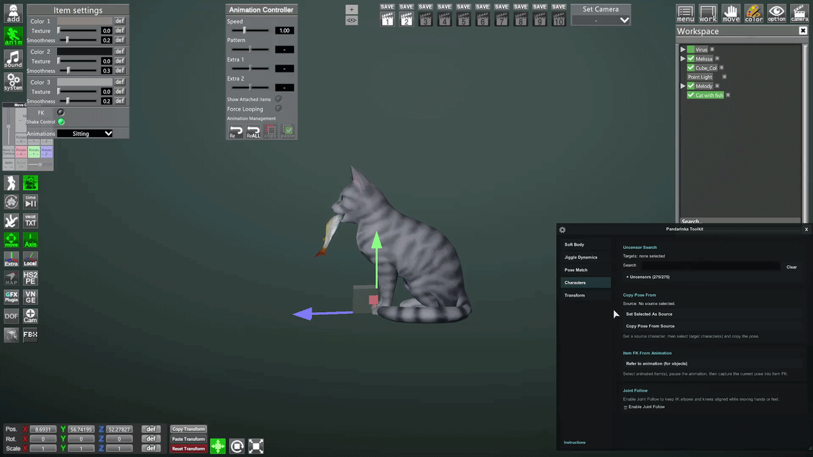

# Refer To Animation

  

**Refer To Animation** captures the current animation pose of selected Studio objects into their FK controls.

Use it when an animated object is paused on the pose you want, and you want its FK points to move to that current animation frame so the pose can be edited manually.

It works on selected objects/items that have FK bones.
