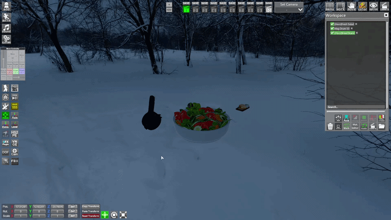
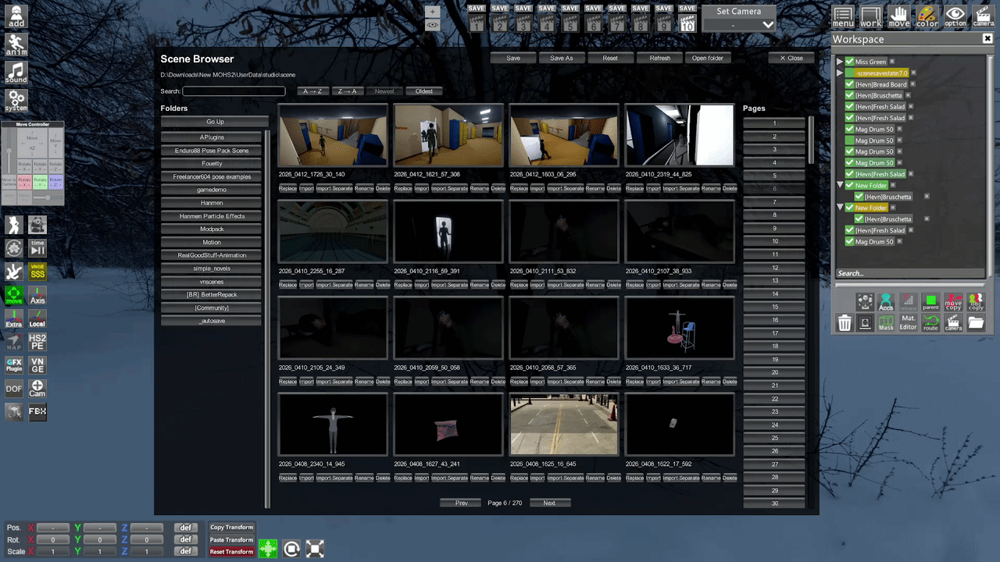

# Scene Browser Pro

<div class="video-preview">
  <iframe
    src="https://www.youtube-nocookie.com/embed/SSrKqiTUP8Q"
    title="Scene Browser Pro video"
    allow="accelerometer; autoplay; clipboard-write; encrypted-media; gyroscope; picture-in-picture; web-share"
    allowfullscreen>
  </iframe>
</div>

[**Scene Browser Pro**](https://www.patreon.com/posts/scenebrowser-pro-152468460) is a performance-focused scene browser for **StudioNEOV2**.

It is built for faster and safer scene work, especially when you are already inside a heavy scene and need to find, load, save, or import scene parts without breaking your workflow.

The main feature is **Separate Import**: click **Separate Import** on another scene, browse that scene's internal tree, select only the exact objects you need, and import them directly into the current scene.

## Credits

Scene Browser Pro is based on the original **SceneBrowser**.

- Original creator: **varnsway**.
- Later contributions: **HentaiSan** and **cur144**.

This version is a heavily reworked performance-focused build with separate import and modern workflow improvements.

## Quick Start

1. Open **Scene Browser Pro**.
2. Browse your scene folders.
3. Select the scene you want to work with.
4. Load, import, rename, delete, or save scenes from the folder you are viewing.
5. Use **Open folder** if you want to open the same folder in Windows Explorer.

## Separate Import

Separate Import is the core reason to use Scene Browser Pro.

Basic workflow:

1. Choose the source scene you want to inspect.
2. Click **Separate Import**.
3. Use search to find the object, folder, character, or scene part you need.
4. Select only the entries you want.
5. Import the selected entries.
6. Wait for the import to finish before touching Studio.

Use it when you only need a few objects from another scene:

- props
- folders
- characters
- lighting setups
- decorations
- scene parts from a large project
- objects that would be annoying to recreate manually

It is much safer for heavy scenes because it does not force a full scene import before you can remove unwanted objects.

## Quick Pick And Stash Synergy

Separate Import has synergy with [Quick Pick](https://www.patreon.com/collection/2136425?view=expanded), [Recycle Bin (Stash)](https://www.patreon.com/posts/recycle-bin-153538889), [Soft Body](soft-body.md), and [Jiggle Dynamics](jiggle-dynamics.md).

[Quick Pick](https://www.patreon.com/collection/2136425?view=expanded) extracted and cached map objects are supported by newer Scene Browser Pro and Quick Pick versions. This is important when a scene contains map objects that were turned into Studio objects through Quick Pick.

[Recycle Bin (Stash)](https://www.patreon.com/posts/recycle-bin-153538889) fits the same workflow: stash heavy objects or scene parts, save or load scenes, and bring those parts back later without treating them like permanently deleted objects.

If the source scene contains [Soft Body](soft-body.md) or [Jiggle Dynamics](jiggle-dynamics.md) data from Pandarinka Toolkit, Separate Import can bring that Toolkit data with the imported objects when the versions are compatible.

## Saving Scenes

Scene Browser Pro can optionally save Studio scenes directly into the folder currently open in Scene Browser, instead of always using:

```text
UserData\Studio\scene
```

Enable **Save Studio Scenes To Current Browser Folder** in the plugin settings if you want the normal Studio **Save** button to save into the folder currently open in Scene Browser.

There are also name prompts in the options:

- **Prompt Name Before Normal Save**: asks for a scene name before normal save.
- **Prompt Name Before Save Separate**: asks for a scene name before Save Separate.

Without a name prompt, Scene Browser uses an automatic timestamp name. For **Save Separate**, if one object is selected, the default name uses that selected object's name.

## Save Separate

<p class="guide-image">
  
</p>

**Save Separate** saves only the selected Studio tree object or selected root objects into a new scene file.

Use it when you want to turn part of the current scene into a small reusable scene:

- one character
- one prop setup
- one folder
- a small decoration group
- a ready-made object bundle

Select the object or folder in the Studio tree, then click the **Save Separate** button added near the Studio workspace buttons, or use the **Save Separate Key** hotkey. The default hotkey is **Shift + S**.

The saved file goes into the current Scene Browser folder.

## Scene File Management

<p class="guide-image">
  
</p>

**Open folder** opens the current Scene Browser folder in Windows Explorer.

You can select multiple scene files with **Ctrl + click**. After that, actions like delete can work on the selected scenes.

Deleting scenes moves them to the **Windows Recycle Bin** instead of deleting them forever. This works for one scene or multiple selected scenes.

You can also drag scene thumbnails onto folders inside Scene Browser. This moves the scene files into that folder. If several scenes are selected, dragging one of them moves the selected group.

Scene file moves and recycle-bin deletes can be undone in the current Studio session.

## Performance Notes

Scene Browser Pro is a heavily reworked version of the original SceneBrowser with performance and stability improvements.

In heavy scene workflows, full import can be slow or unstable. Separate Import is meant to bring in only the needed character or items with less cleanup and better stability.

Actual speed depends on the scene, object count, map complexity, and your PC.

## Common Problems

**Separate Import is slow.**

Wait until the process finishes before doing anything else in Studio. Recording, huge scenes, large folders, and many map objects can make import slower.

**Quick Pick objects import as missing spheres.**

Update both Scene Browser Pro and [Quick Pick](https://www.patreon.com/collection/2136425?view=expanded).

**Some objects import badly.**

Some scene objects can have special import issues. **MK90 Lights** are not fully supported with Separate Import.

**Studio crashes while using Scene Browser Pro.**

This can happen because of an incompatibility with the **GlobalSearch** plugin. If Studio crashes around Scene Browser actions, try disabling **GlobalSearch** and test the same scene again.

## Notes

- [BepInEx 5](https://github.com/BepInEx/BepInEx/releases) is required.
- [Advanced Item Search](https://gofile.io/d/m03H5K) is required for full item names in lists.
