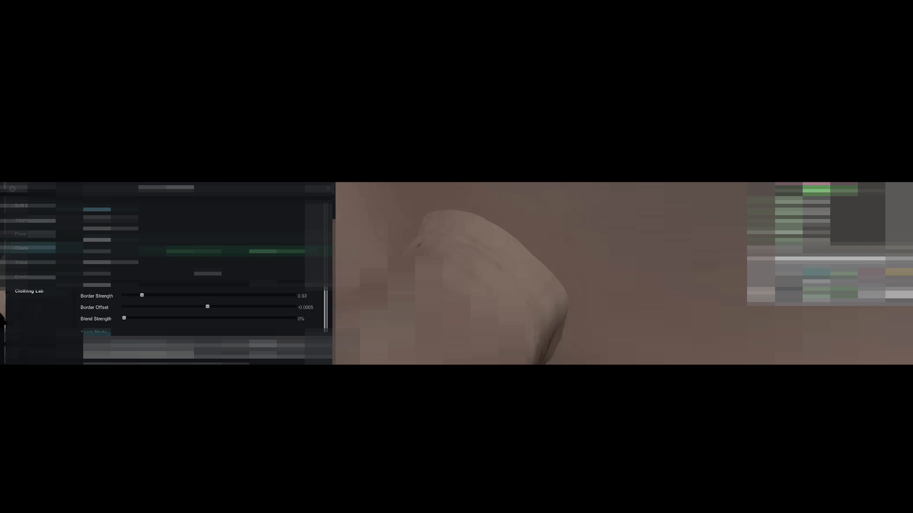
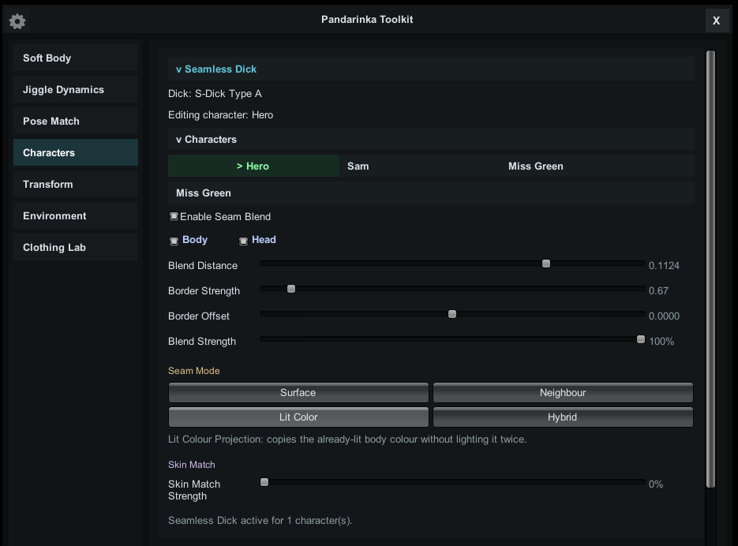

# Seamless Dick

  

**Seamless Dick** creates a smoother visual transition between a penis and a character's skin using a separate shader.

## Getting Started

1. Position the object close to or slightly intersecting the character's surface.
2. Select the object in the Studio tree. To use a character's penis uncensor, select the character instead.
3. Expand **Seamless Dick > Characters** and choose a target character.
4. Manually enable **Enable Seam Blend**.
5. Enable **Body**, **Head**, or both.
6. Adjust the transition and add other characters if you need to.

The shader is applied automatically in Material Editor. **Uncensor** renderers use names beginning with `cm_o_dan00`. This shader works with all cock objects as far as I know.

**Important:** select the source in the Studio tree, then select target characters inside Toolkit. Clicking a character's name in Toolkit only opens their settings; it does not enable the effect.

Enabled characters are highlighted green. Multiple characters can be enabled at the same time, each with independent transition settings.

## Transition Settings

  

- **Blend Distance - default 0.1124:** controls the transition width. Higher values affect a larger area.
- **Border Strength - default 0.67:** controls the transition's falloff and edge definition.
- **Border Offset - default 0:** shifts the transition boundary without moving the object.
- **Blend Strength - default 100%:** controls the overall effect intensity.

Body and Head have separate switches but share the selected character's transition settings.

## Seam Modes

- **Neighbour:** blends nearby sampled skin colors for a softer transition. Default mode.
- **Surface:** also softens normal-map and gloss differences around the join.
- **Lit Color:** blends the character's already-lit surface color.
- **Hybrid:** combines color blending with a narrow edge cutout.

## Skin Match And Colors

**Skin Match Strength** controls additional material correction. It belongs to the selected object or uncensor and stays unchanged when switching target characters. It does not automatically pick a new skin color.

Adjust colors and textures in **Material Editor**. On models with a compatible color mask, such as Hooh dick:

- **BaseColor:** affects the whole material.
- **Color:** affects the main area.
- **Color2:** affects the glans.

## More Examples

More detailed interaction examples are available on my [Discord server](https://discord.com/invite/Ndzqjv8awk), because they include 18+ content.
