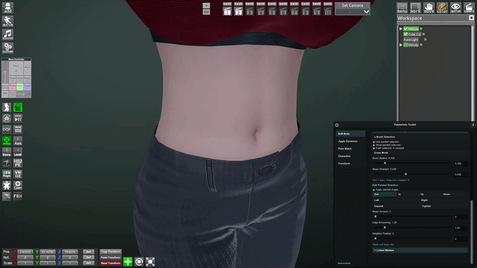
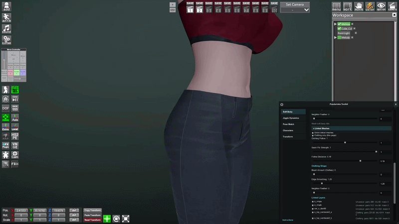
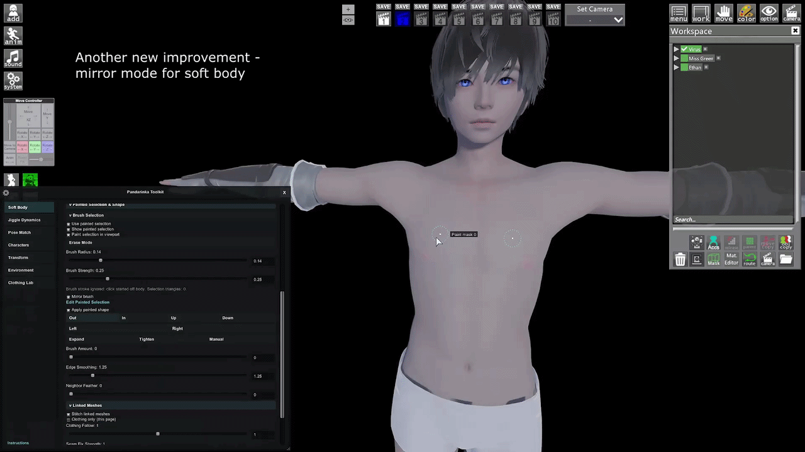
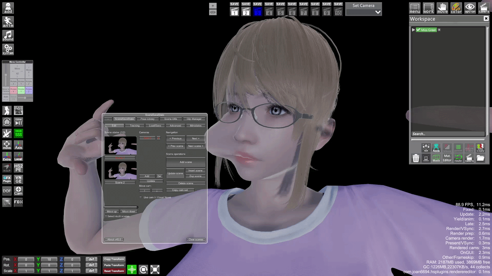
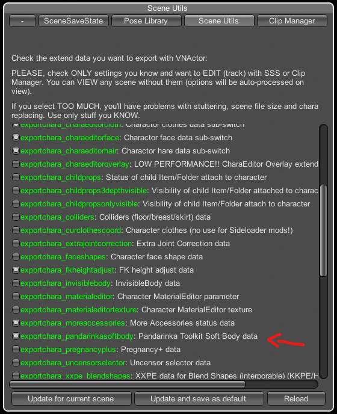
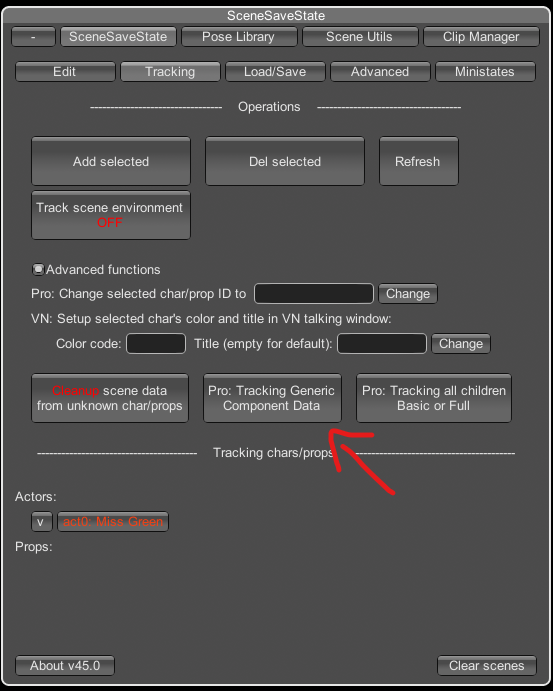
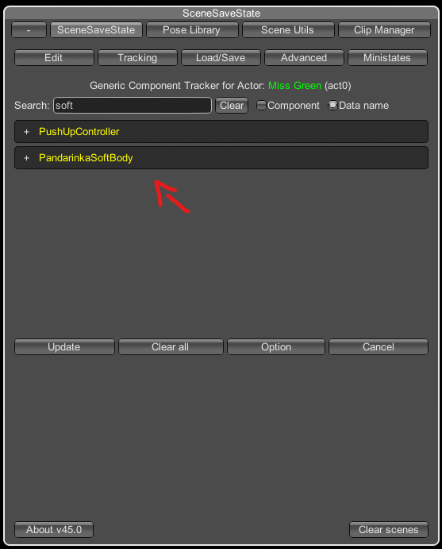

# Soft Body

**Soft Body** is used for manual body, head, clothing, and simple object mesh shaping in Studio.

Use it when you want to push, pull, expand, tighten, or smooth a painted area on a character body, head, clothing mesh, or simple object mesh.

Soft Body now has two modes:

- **Characters & Clothes**: for body, head, uncensor, clothes, hair, and linked character meshes.
- **Objects**: for simple object meshes, including snow fields. This can be useful, but it may be unstable on some objects.

The video guide is available on my [Discord server](https://discord.com/invite/Ndzqjv8awk).

<div class="guide-gif-gallery">
  
  
</div>

## Quick Start

1. Open **Pandarinka Toolkit**.
2. Go to **Soft Body**.
3. In **Characters**, choose the character you want to edit.
4. Turn on **Enable Plugin**.
5. Choose a page: **1**, **2**, **3**, and so on.
6. Open **Painted Selection & Shape**.
7. Open **Brush Selection**.
8. Turn on these options:
   - **Use painted selection**
   - **Show painted selection** (**V**)
   - **Paint selection in viewport** (**B**)
9. Paint the area directly on the character in the viewport.
10. Choose a direction, then adjust **Brush Amount**.

The basic idea is simple: first paint where the edit should happen, then choose how that painted area should move.

## Pages

Pages let you keep different edits separate.

Use **page 1** for one deformation, **page 2** for another, **page 3** for another, and so on. This is useful when you want one area shaped one way and another area shaped differently.

Example:

1. Use **page 1** for a belly edit.
2. Use **page 2** for a breast edit.
3. Use **page 3** for a clothing-only edit.

Each page keeps its own painted selection and shape settings.

**Active page** controls only the current page. If you turn it off, that page keeps its settings, but stops affecting the mesh.

Newer versions have more Soft Body pages, so you can keep more independent edits inside one character or object setup.

## Mirror Brush

<p class="guide-image">
  
</p>

**Mirror Brush** creates a mirrored brush on the opposite side.

When this mode is enabled, brush strokes are mirrored instantly while painting instead of requiring a separate mirror action. This means you paint on one side, and Soft Body paints the matching mirrored area on the other side at the same time.

## Painted Selection & Shape

Open **Painted Selection & Shape**, then open **Brush Selection** to paint the area you want to edit.

Turn on:

- **Use painted selection**: tells Soft Body to use the painted mask for editing.
- **Show painted selection** (**V**): shows the painted area in the viewport.
- **Paint selection in viewport** (**B**): lets you paint directly on the character.

You can also use hotkeys:

```text
V: show or hide the painted selection
B: turn viewport painting on or off
N: switch between paint mode and erase mode
```

## Brush Controls

**Brush Radius** controls how wide the paint brush is.

Use a smaller radius for tight areas, edges, fingers, seams, or small clothing details.

Use a larger radius for big soft areas, like belly, breast, butt, thigh, or broad clothing shapes.

If the painted area is too hard to control, lower the radius first.

You can also change **Brush Radius** with the mouse wheel while painting in the viewport.

**Brush Strength** controls how quickly painting changes the selection.

Higher strength fills the selection faster.

Lower strength gives softer control and is better when you want to build the selection slowly.

If the selection becomes too strong or too wide, switch to **Erase Mode** or press **N**, then erase the extra area.

## Edit Painted Selection

After you paint a selection, choose how it should move.

- **Out**: pushes the painted area outward from the surface.
- **In**: pushes the painted area inward.
- **Up** / **Down**: moves the painted area vertically.
- **Left** / **Right**: moves the painted area sideways.
- Rounded shape controls:
  - **Expand**: spreads the area outward from its center. This is best for rounded forms, for example around an arm or leg, but it can be used anywhere it gives the right shape.
  - **Tighten**: pulls the area inward toward its center. This is best for rounded forms, for example around an arm or leg, but it can be used anywhere it gives the right shape.
- **Manual**: shows a viewport gizmo so you can move the painted zone by hand instead of relying only on direction buttons and sliders.

For most body shaping, start with **Out** or **In**.

Turn on **Apply painted shape** to keep the painted area deformed.

Then use:

- **Brush Amount** for how far the body or skin moves.
- **Edge Smoothing** for how smooth the deformation is inside the painted area.
- **Neighbor Feather** for how much nearby mesh is softly included around the painted selection.

Start with **Brush Amount**. This is the main slider.

If the shape looks too sharp, raise **Edge Smoothing**.

If the edge of the painted area looks too sudden, raise **Neighbor Feather** a little.

Use **Manual** when the normal directions are not enough. Move the gizmo in the viewport until the zone goes exactly where you want it.

**Brush Amount** is the main strength of the manual shape.

Raise it slowly. A small change is often enough.

The direction buttons decide where the painted area moves. **Brush Amount** decides how far it moves.

**Edge Smoothing** smooths the deformation inside the painted selection.

It does not make the painted area bigger. It makes the shape less sharp and less lumpy.

Use it when the result has visible bumps or uneven parts inside the selected area.

**Neighbor Feather** softly includes nearby vertices around the painted selection.

At **0**, the deformation stays inside the painted selection.

Raise it when the edge of the deformation looks too harsh or when the shape needs to blend into the surrounding body.

Do not raise it too much if you need a tight, precise edit.

## Linked Meshes (Clothes)

Use **Linked Meshes** when the edit should affect clothing or nearby linked mesh parts.

For normal body edits, **Stitch linked meshes** makes clothing follow the skin changes.

For clothing-only edits, turn on **Clothing only (this page)**. In this mode, the painted body area is used as a guide, but the page deforms clothing instead of the body.

Main controls:

- **Clothing Follow**: how strongly clothing follows the current Soft Body deformation.
- **Seam Fix Strength**: fixes the character mesh borders. If this is lower than **1**, holes can appear where the uncensor mesh connects.
- **Follow Distance**: how far from the body a linked clothing or seam vertex can be and still follow the deformation.
- **Brush Amount (Clothes)**: the main strength for clothing-only deformation. This slider works only for clothing, not skin.
- **Edge Smoothing** under **Clothing Shape**: smooths the clothing deformation inside the selected clothing area.
- **Neighbor Feather** under **Clothing Shape**: softly extends the clothing deformation to neighboring triangles.

If clothing does not react, make sure **Clothing only (this page)** is on, the page has a painted area, and the needed layer is enabled under **Linked Layers**.

When you hover clothing layers, the plugin highlights the layer in the viewport. Use this to see which layer you are about to enable, disable, or edit.

There is also a checkbox to enable or disable all clothing layers at once. Use it when you want to quickly isolate one layer or bring every layer back.

## Objects

The **Objects** tab lets Soft Body edit simple object meshes.

Use it for snow fields, simple props, and other objects where you want manual mesh shaping.

Quick workflow:

1. Select a Studio object or folder.
2. Open **Soft Body**.
3. Switch from **Characters & Clothes** to **Objects**.
4. Turn on **Enable Plugin**.
5. Choose a page.
6. Open **Meshes** and enable the object layers you want to edit.
7. Paint the area in the viewport.
8. Use **Edit Painted Selection** to push, pull, smooth, or manually move the painted zone.

Object layers are highlighted when you hover them, so you can see which mesh layer you are working with.

This is especially useful with **Environment** snow fields: create a snow field, then use Soft Body Objects to push parts down, pull parts up, or make the snow surface less flat.

Object Soft Body may not work correctly on every object. If an object has unusual mesh data, complex shaders, or very heavy geometry, try a simpler object or a smaller selection.

## Presets

**Presets** are used to save and copy the full Soft Body page set.

When you click **Create / Update**, the plugin saves all Soft Body pages: painted selections, directions, shape sliders, clothing-only states, and linked mesh settings.

When you select a preset and click **Apply**, the saved page set is copied back into Soft Body.

Use presets when you want to reuse the same Soft Body setup on another character or another scene.

Presets work correctly only with the same uncensor type they were made on. If you apply a preset to a character with a different uncensor, the shape may not match.

Main buttons:

- **Create / Update**: saves the current Soft Body page set into the preset name field.
- **Apply**: copies the selected preset back into Soft Body.
- **Open Folder**: opens the folder where preset files are stored.
- **Rename**: renames the selected preset.
- **Delete**: removes the selected preset.

Soft Body presets are stored here:

```text
BepInEx/plugins/PandarinkaToolkit/Presets/mesh_soft_body_page
```

A new chat called **presets** was recently created in my [Discord channel](https://discord.com/invite/Ndzqjv8awk). You can use it to share your Soft Body presets with other users.

## VNGE Support

<p class="guide-image">
  
</p>

Soft Body state includes both **Characters & Clothes** and **Objects** data.

### Option 1: Install the VNGE Patch

This method adds a dedicated Soft Body entry to the VNActor export list. I recommend this option.

1. Make sure **Pandarinka Toolkit 3.6.0** is installed.
2. Close Studio.
3. Make backup copies of:
   - `BepInEx/Plugins/Console/Lib/vnactor.py`
   - `BepInEx/Plugins/Console/Lib/vnactor.ini`
4. Extract [VNGE45-PandarinkaSoftBody-Patch.zip](https://gofile.io/d/G6MLpZDe) into the game folder.
5. Allow both VNGE files to be replaced.
6. Start Studio.
7. Open **VNGE SSS -> Scene Utils -> VNActor**.
8. Enable `exportchara_pandarinkasoftbody`.

<p class="guide-image">
  
</p>

9. Click **Update and save as default**, or **Update for current scene** if you only need it in the current scene.
10. Use VNActor normally. Creating or updating an actor state will now include its Soft Body data.

The patch is made specifically for [**VNGE 45.0**](https://www.patreon.com/c360plugins/posts/vnge-v45-0-166251564).

### Option 2: Use Generic Component Tracker

This method does not replace or modify any VNGE files. Soft Body will not appear as a separate option in the VNActor export list. I do not recommend this method because you have to enable it for every character manually every time. But still, if it is more convenient for someone, then go ahead.

1. Make sure **Pandarinka Toolkit 3.6.0** is loaded.
2. Open **VNGE -> SceneSaveState -> Tracking**.
3. Select exactly one character in the Studio workspace.
4. Click **Add selected** if the character is not already tracked.
5. Enable **Advanced functions**.
6. Click **Pro: Tracking Generic Component Data**.

<p class="guide-image">
  
</p>

7. Search for `PandarinkaSoftBody`.

<p class="guide-image">
  
</p>

8. Expand the component.
9. Enable the `SoftBodyState` property.
10. Click **Update**.

Repeat the setup for every character that needs Soft Body tracking.

**PS:** For **Objects** data, at least one tracked character is required because the combined Soft Body state is exported through the character's `PandarinkaSoftBody` component.

## Common Problems

**Nothing changes**

Check that a character is selected, **Enable Plugin** is on, the current page is active, **Use painted selection** is on, and **Apply painted shape** is on.

**I can paint, but I cannot see the selection**

Turn on **Show painted selection** or press **V**.

**Painting does not work in the viewport**

Turn on **Paint selection in viewport** or press **B**.

**The skin mesh does not change while tight clothing is worn**

Some clothing uses blendshapes to create a tight or squeeze effect on the body. In that case the visible skin squeeze comes from the clothing, not from the skin mesh itself. Edit the clothing with **Clothing only (this page)** instead of editing the skin.

**FPS drops hard when Meina Deformation is enabled**

Soft Body can conflict with **Meina Deformation (MD)** while **Paint selection in viewport** is enabled. In some scenes, FPS can drop extremely low during painting.

Turn off **Meina Deformation** before painting Soft Body selection. After you finish painting, you can turn Meina Deformation back on.

**Object Soft Body does not work on an object**

The Objects tab is made for simple object meshes. Some objects may not deform correctly yet. Try another object, a simpler mesh, or a smaller painted area.

## Notes

- **Reset** clears only the current page.
- If **Reset** does not visually clear the result, click **Enable Plugin** twice: off, then on.
- Almost all Soft Body actions can be undone or redone with **Ctrl + Z** and **Ctrl + Shift + Z**.
- Works with the **Pregnancy Plus** plugin.
- Works with [**Environment**](environment.md) snow fields.
- [Scene Browser Pro separate import](scene-browser-pro.md) works with Soft Body.
- [Recycle Bin (Stash)](recycle-bin.md) works with Soft Body.
- Recent fixes improved page isolation, Linked Meshes head-zone behavior, presets, and small visual/UI issues.
