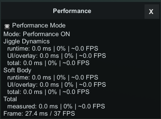

# Toolkit Options

<div class="video-preview">
  <iframe
    src="https://www.youtube-nocookie.com/embed/_Vw4AJ6jK7E"
    title="Toolkit Options video"
    allow="accelerometer; autoplay; clipboard-write; encrypted-media; gyroscope; picture-in-picture; web-share"
    allowfullscreen>
  </iframe>
</div>

**Options** is the built-in settings section inside **Pandarinka Toolkit**.

Open it with the gear button in the top-left corner of the Toolkit window.

## What You Can Change

- Hotkeys.
- Window size.
- Window position.
- Window opacity.
- Soft Body selection opacity.
- Performance Monitor visibility.

Window size and position are saved automatically.

## Default Shortcuts

```text
Shift + K: Toolkit window
Shift + P: Pose Match
Keypad1: Pose Match IK
Keypad3: Pose Match FK
U: Drop to Surface
V: Soft Body selection visibility
B: Soft Body paint selection
N: Soft Body erase mode
O: Jiggle contact areas
Performance Monitor: not assigned by default
```

You can change these shortcuts in **Options**. Press **Set** near the shortcut you want to change, then press the new key combination. Use **Default** to restore one shortcut, or **Off** to disable it.

## Performance

<div class="guide-image">
  
</div>

The **Performance Monitor** is a small separate window for checking how much time Toolkit features spend each frame.

It shows **Jiggle Dynamics**, **Soft Body**, and total frame information. Use it when a scene feels slow and you want to see whether Jiggle Dynamics or Soft Body is adding noticeable cost.

**Performance Mode** reduces Soft Body overlay detail and reuses static painted shapes when possible. It is enabled by default, and it is always better to keep it enabled.

## Toolbar Icons

Pandarinka Toolkit adds a Toolkit icon to the Studio toolbar.

It also adds a Pose Match icon that opens the Toolkit directly on the **Pose Match** page.
